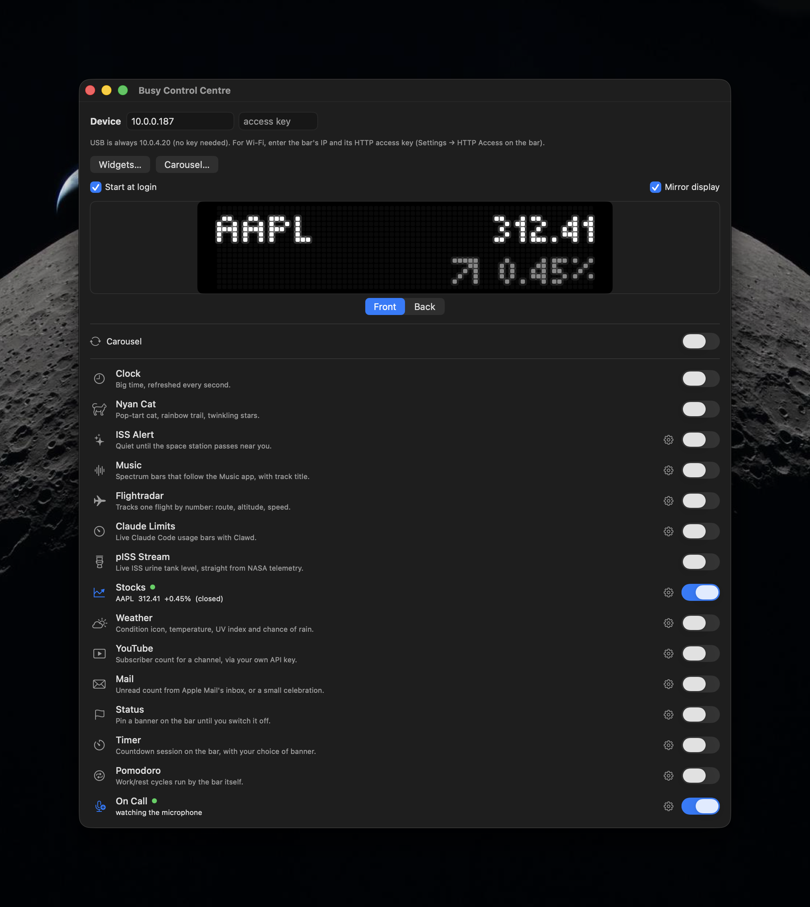

# Busy Control Centre

A native macOS app for the [BUSY Bar](https://busy.app) — a launcher for small
widgets that draw on the bar's 72×16 LED panel, plus focus sessions and a live
mirror of the display.

Everything talks to the device's local HTTP API. No cloud, no accounts, no
third-party dependencies — SwiftUI and the system frameworks only.

<p align="center">
  
</p>

## Widgets

| | |
|---|---|
| **Clock** | Big time, refreshed every second |
| **Nyan Cat** | Pop-tart cat, rainbow trail, twinkling stars |
| **ISS Alert** | Quiet until the space station passes near you |
| **Music** | Spectrum bars following the Music app, with track title |
| **Flightradar** | Tracks one flight by number: route, altitude, speed |
| **Claude Limits** | Live Claude Code usage bars with the Clawd mascot |
| **pISS Stream** | ISS urine-tank level from NASA telemetry, à la [pISSStream](https://github.com/Jaennaet/pISSStream) |
| **Stocks** | Watchlist prices and the day's change; the arrow greys out when that exchange is shut |
| **Weather** | Condition icon, temperature, UV index and chance of rain |
| **YouTube** | Subscriber count for a channel, using your own API key |
| **Mail** | Unread count from Apple Mail's inbox, or a small celebration |
| **Status** | Pin a banner on the bar until you switch it off |
| **Timer** | Countdown run by the bar, with your choice of banner |
| **Pomodoro** | Work/rest cycles run by the bar |
| **On Call** | Mic in use → the bar shows an ON CALL banner |

Widgets draw via `/api/display/draw`. Status, Timer, Pomodoro and On Call instead
drive the device's built-in focus session (`/api/busy/snapshot`), which renders
the bar's own themed animations at session priority.

**Choosing and rotating them.** Two windows, ⌘⇧1 and ⌘⇧2. *Widgets* picks which
ones the main list shows, so it stays short. *Carousel* picks a set to rotate
through and how many seconds each gets; the two selections are independent, and
switching a widget on by hand stops the rotation so the bar stays where you put
it.

**Priority.** Sessions outrank widgets, and the mic outranks everything: when
On Call takes the screen it captures any running timer and restores that exact
snapshot afterwards, so the countdown resumes rather than restarting.

## Display mirror

The main window can mirror what the bar is showing, drawn as an LED matrix —
one dot per device pixel, with bloom on lit dots.

`/api/screen` is worth a note for anyone else building against it: it advertises
`Content-Type: image/bmp`, but the body is **base64-encoded BGR888 with no
header**. Payload length identifies the panel — 3456 bytes for the front
(72×16), 38400 for the back (160×80).

## Building

Requires macOS 14+, Xcode 15+, and [xcodegen](https://github.com/yonaskolb/XcodeGen).

```sh
brew install xcodegen
xcodegen generate
open BusyBar.xcodeproj
```

The Xcode project is generated from `project.yml` and is not committed. Set
`DEVELOPMENT_TEAM` in `project.yml` to your own team ID before signing.

Releases are built by CI on tag push (`v*`); see `.github/workflows/release.yml`.
Signing and notarisation are optional and enabled by setting the repository
secrets documented in that workflow — without them CI still produces an
unsigned build for testing.

## Banner artwork

The banner picker previews each theme with a real frame from the bar's own
animation, taken from the firmware repository. Those images are CC-BY-SA-4.0 and
are committed under `Resources/Themes/` — refresh them with
`./Scripts/fetch-themes.sh`. Any theme without artwork falls back to a text
label. See [Attributions](#attributions).

## Connecting

Over USB the bar is always at `10.0.4.20` and needs no key. Over Wi-Fi, enter
its IP and the HTTP access key from Settings → HTTP Access on the device; the
app sends it as `X-API-Token`.

macOS will ask for Local Network permission on first launch. If the prompt never
appears and the app cannot reach the bar, see [docs/troubleshooting.md](docs/troubleshooting.md).

## Attributions

| What | Source | License |
|---|---|---|
| Banner artwork in `Resources/Themes/` | [busy-app/busybar-firmware](https://github.com/busy-app/busybar-firmware) `assets/shared/animations`, © 2024–2026 Flipper FZCO. One frame extracted per animation, images otherwise unmodified. | [CC-BY-SA-4.0](https://creativecommons.org/licenses/by-sa/4.0/) |
| pISS Stream widget | Idea from [pISSStream](https://github.com/Jaennaet/pISSStream); telemetry from NASA's public ISS Lightstreamer feed | — |
| Weather data | [Open-Meteo](https://open-meteo.com/) | [CC-BY-4.0](https://creativecommons.org/licenses/by/4.0/) |
| Widget data | wheretheiss.at, adsb.fi, adsbdb.com, Yahoo Finance (unofficial endpoint), YouTube Data API v3 | their respective terms |

Also shown in the app under **Busy Control Centre → About**.

## License

MIT — see [LICENSE](LICENSE), except the banner artwork noted above, which stays
under CC-BY-SA-4.0. Not affiliated with or endorsed by BUSY.
